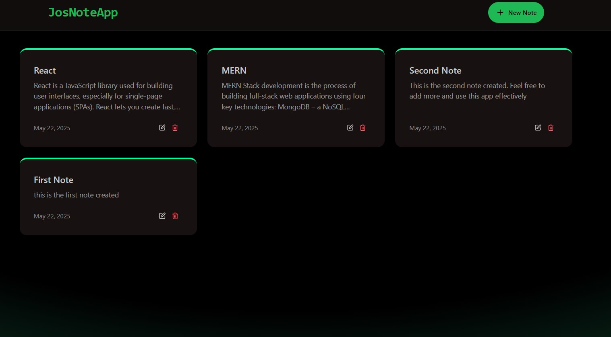
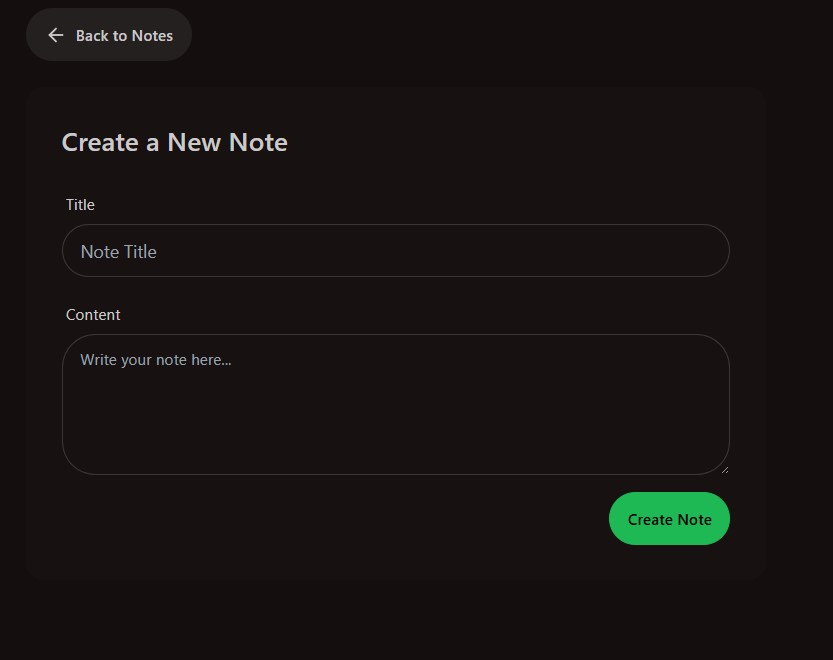
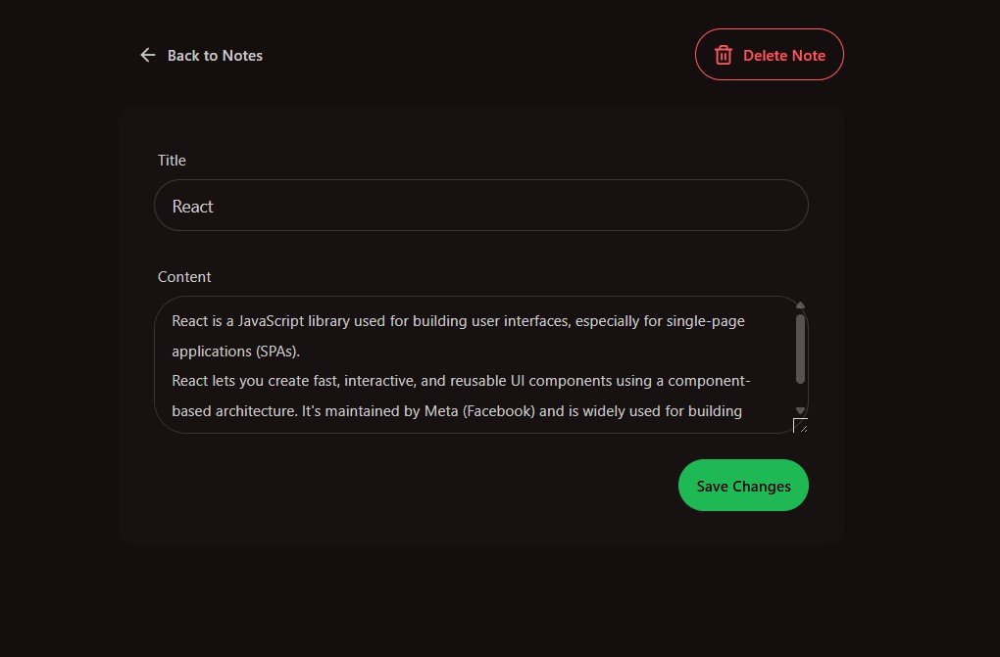
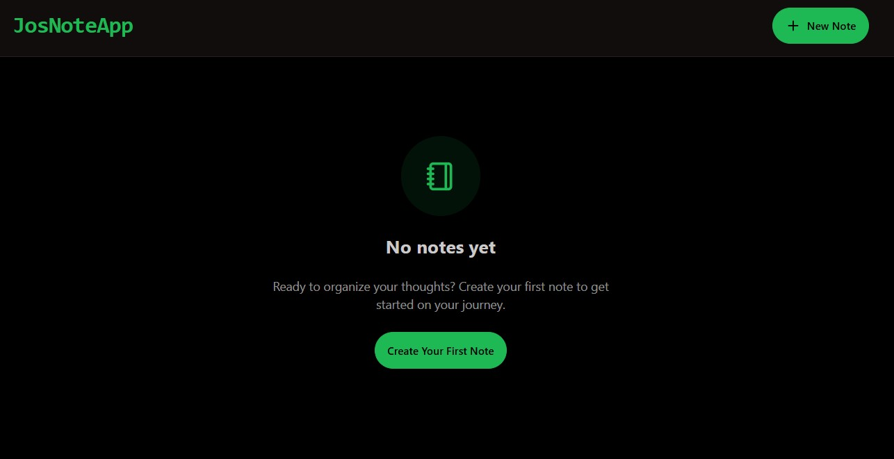
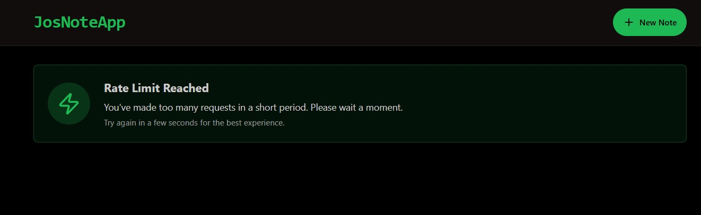

# 📝 MERN NoteApp

A **MERN stack** application for creating, editing, and managing notes. This project is designed to help users organize their thoughts and ideas efficiently. It features a responsive UI built with **React**, a backend powered by **Express** and **MongoDB**, and rate-limiting functionality using **Upstash Redis**.

🚀 **Live Demo**: [MERN NoteApp on Render](https://mern-noteapp-4mpw.onrender.com/)

---
## 📂 Project Structure

The project is divided into two main directories:

### `frontend/`
- Built with **React** and **Vite**.
- Styled using **TailwindCSS** and **DaisyUI**.
- Includes:
  - **Pages**: Home, Create Note, Note Details.
  - **Components**: Navbar, NoteCard, NotesNotFound, RateLimitedUI.
  - **Libraries**: Axios for API calls, React Router for navigation, React Hot Toast for notifications.

### `backend/`
- Built with **Express.js**.
- Database: **MongoDB** (via Mongoose).
- Includes:
  - **Routes**: Notes CRUD operations.
  - **Controllers**: Logic for handling API requests.
  - **Middleware**: Rate limiter using **Upstash Redis**.
  - **Environment Variables**: Managed via `.env`.

---
## ✨ Features

- **Create, Read, Update, Delete (CRUD)** notes.
- **Rate Limiting**: Prevents excessive requests using Upstash Redis.
- **Responsive Design**: Works seamlessly on all devices.
- **Error Handling**: User-friendly error messages and notifications.
- **Deployed**: Hosted on Render for easy access.

---
## 🛠️ Technologies Used

### Frontend:
- ⚛️ **React** (with React Router)
- ⚡ **Vite** (for fast development)
- 🎨 **TailwindCSS** and **DaisyUI** (for styling)
- 🔥 **React Hot Toast** (for notifications)

### Backend:
- 🖥️ **Express.js**
- 🗄️ **MongoDB** (via Mongoose)
- 🚦 **Upstash Redis** (for rate limiting)
- 🌐 **CORS** (for cross-origin requests)

---
## 📸 Screenshots

### Home Page

### Create Note

### Note Details and update

### Empty Note

### Rate Limit

📜 License
This project is licensed under the MIT License. Feel free to use and modify it as needed.

🤝 Contributing
Contributions are welcome! If you'd like to contribute, please fork the repository and submit a pull request.

📧 Contact
For any inquiries or feedback, feel free to reach out:

Email: yosephawoke8@example.com
GitHub: YosephAwoke